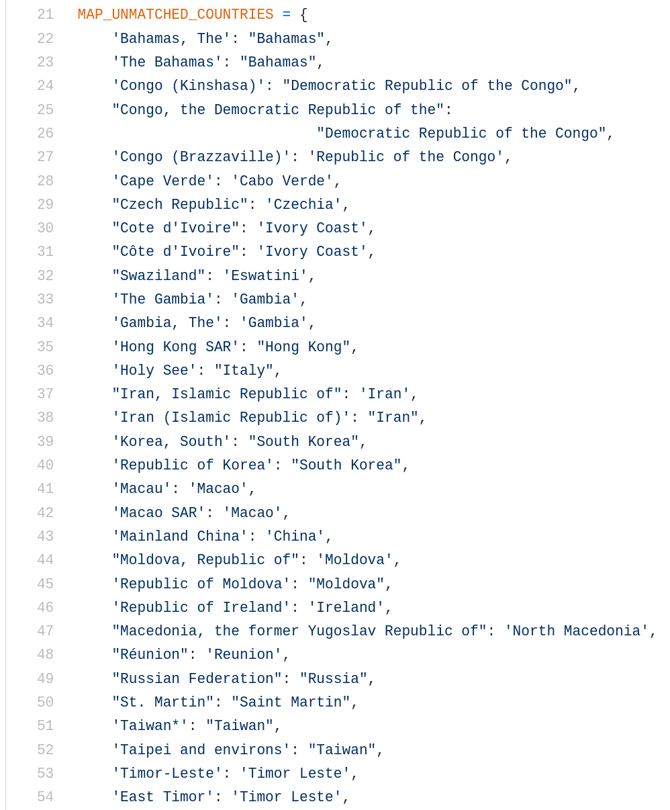
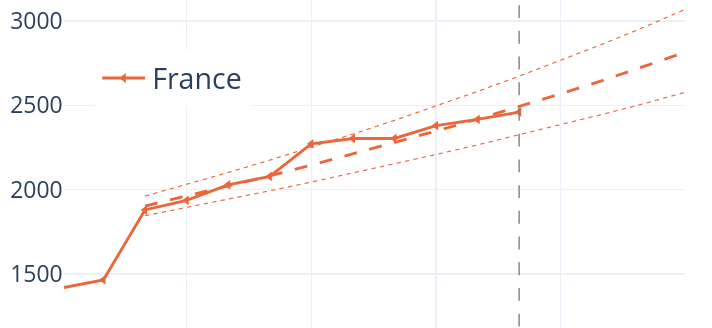
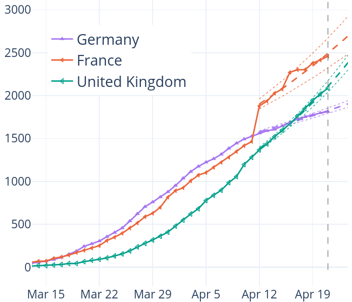

class: center, middle

# Covid19-dash

Emmanuelle Gouillart & Gaël Varoquaux

https://covid19-dash.github.io/

Russ Poldrack, Guillaume Lemaitre, Ashwin PN, Mojdeh Rastgoo Lemaitre, Ranjan
Khyadad, Marianne Corvellec, Elizabeth DuPre

???

Some notes go here including this list:

---

# Pourquoi: Sensibiliser le grand public

**Début mars**: Indifférence généralisée.

Non compréhension de la croissance exponentielle.

Ergotage sur les termes pandémie et phase 3.

.red.shift-left.width60.pull-left[
Dashboards existants à l'époque:

* Évolution de la Chine uniquement
* Trop technique
]
.green.width40.shift-right.pull-right[
Conséquences:

* Présentation simple
* Explications texte
]

---

# Techno web pour chercheurs pressés

* Python
* Plotly
* Dash

.xxxlarge[🐍]

---

# Demo

* Limiter les interactions
* Choix: 
    * Rapporté à la population (infos complètes dans le hover)
    * Lin vs. log
    * Cas confirmés et décès

---

# Développement pour chercheurs maladroits

* GitHub Actions
* Fonctionnement communautaire: revue des pull requests grâce aux artifacts
  Circle CI

---

# Data wrangling

* Source de données

   * Johns Hopkin University
   * Cas détectés et dates

* Croiser les données

   * Appariement d'entitées

.xxxlarge[🐼]

---

# Modèle prédictif

.shift-right.pull-right[

]

* Modèle linéaire en échelle log
* Fenêtre sur 14 jours
* Poids décroissant avec le temps
* Validation en rejouant l'historique

https://github.com/covid19-dash/covid-dashboard/blob/master/modeling.py

---
class: center, middle

# Thank you

.xxxlarge[😸]
